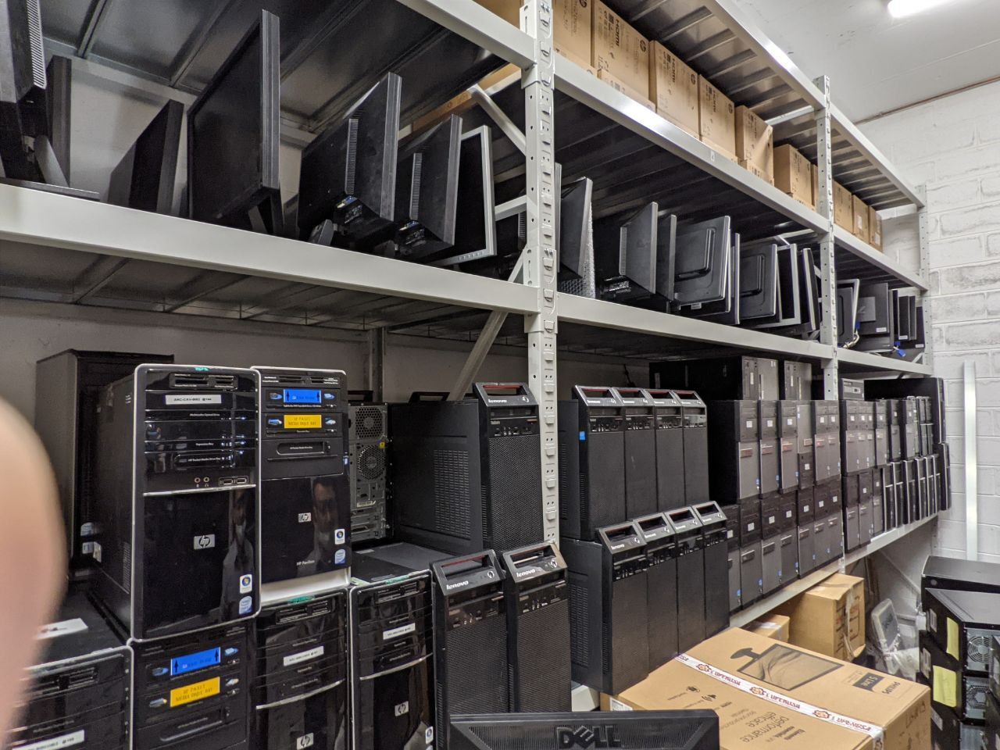

+++

title = "Amatorial Container-as-a-Service for Busy Scholars"
description = "Amatorial Container-as-a-Service for Lazy Scholars"
outputs = ["Reveal"]
aliases = [
    "/slides/"
]

+++

# Amatorial Container-as-a-Service for <s>Lazy</s> Busy Scholars

### [Giovanni Ciatto](https://www.unibo.it/sitoweb/giovanni.ciatto/en)

(material from <https://doi.org/10.1109/ACSOS-C58168.2023.00052>)

---

{}

## About me (pt. 1)

### Overview

- __Name__: _Giovanni Ciatto_

- __Role__: Junior _Assistant Professor_ at DISI/UniBO since 2023

- __Education__: _PhD_ in Data Science (2022), _MSc_ in Computer Science (2017), _BSc_ in Computer Engineering (2014), all of them at UniBO, in Cesena, Italy

- __Profiles__: [Scholar](https://scholar.google.it/citations?hl=it&pli=1&user=pLlROlkAAAAJ), [GitHub](https://github.com/gciatto), [ORCID](https://orcid.org/0000-0002-1841-8996), [UniBO](https://www.unibo.it/sitoweb/giovanni.ciatto/en)

---

## About me (pt. 2)

### Relevant academic activities

1. __Technical coordinator__ and __WP leader__ in the Horizon EU project [AEQUITAS](https://www.aequitas-project.eu/) (G.A. [101070363](https://doi.org/10.3030/101070363))
    * AEQUITAS $\equiv$ *Assessment and *E*ngineering of *Eq*uitable, *U*nbiased, *I*mpartial and *T*rustworthy *A*I *S*ystems

2. __WP leader__ in the [CHIST-ERA IV](https://www.chistera.eu/projects-call-2019) project [EXPECTATION](https://expectation.ehealth.hevs.ch)
    * EXPECTATION $\equiv$ Personalized Explainable Artificial Intelligence for decentralized agents with heterogeneous knowledge

3. __Teacher__ in several _master_ courses concerning software engineering, artificial intelligence, and distributed systems
    * [Software Engineering](https://www.unibo.it/en/study/phd-professional-masters-specialisation-schools-and-other-programmes/course-unit-catalogue/course-unit/2023/466765)
    * [Distributed Systems (Module 2)](https://www.unibo.it/en/study/phd-professional-masters-specialisation-schools-and-other-programmes/course-unit-catalogue/course-unit/2023/493397)
    * [Intelligent Systems Engineering (Module 2)](https://www.unibo.it/en/study/phd-professional-masters-specialisation-schools-and-other-programmes/course-unit-catalogue/course-unit/2023/455810)
    * [Software Process Engineering (Module 2)](https://www.unibo.it/en/study/phd-professional-masters-specialisation-schools-and-other-programmes/course-unit-catalogue/course-unit/2023/483714)

---

## About me (pt. 3)

### Research interests

1. **Multi-Agent Systems** and **Agent-Oriented Programming**
    * cf. Martina's presentation
    * recent relevant papers: [doi:10.1007/s10458-020-09478-3](https://doi.org/10.1007/s10458-020-09478-3), [doi:10.1007/978-3-031-43264-4_4](https://link.springer.com/chapter/10.1007/978-3-031-43264-4_4)

2. **Distributed Systems**
    * cf. this presentation
    * recent relevant papers: [doi:10.1109/ACSOS-C58168.2023.00052](https://doi.org/10.1109/ACSOS-C58168.2023.00052), [doi:10.1109/ICCCN.2019.8846916](https://doi.org/10.1109/ICCCN.2019.8846916)

3. **Artificial Intelligence** and **Machine Learning**
    * cf. the AEQUITAS project
    * recent relevant papers: [doi:10.1145/3645103](https://doi.org/10.1145/3645103), [abs/2404.04108](https://arxiv.org/abs/2404.04108)

4. **eXplainable AI** (XAI)
    * cf. the EXPECTATION project
    * recent relevant papers: [doi:10.1016/j.cmpb.2023.107536](https://doi.org/10.1016/j.cmpb.2023.107536), [doi:10.1007/978-3-031-40878-6_3](https://doi.org/10.1007/978-3-031-40878-6_3)

5. **Logic Programming**
    * recent relevant papers: [doi:10.1017/S1471068422000102](https://doi.org/10.1017/S1471068422000102), [doi:10.1016/j.softx.2021.100817](https://doi.org/10.1016/j.softx.2021.100817)

{}

---

## Problem statement

What __hardware__ resources are available for _researchers_ in our university _campus_?

---

Provisioned via competitive projects, in different moments

* __1__ x NVIDIA Tesla GPU, __15__ x Ascend Atlas NPU
  + Intel(R) Xeon(R) CPU @ 2.90GHz (_64–96_ cores, _200--800_ GB RAM) 

* __2__ x storage servers (_4–8_ TB each, with RAID)

* several switches and routers

---

Provisioned by the campus / department, via ordinary funding

* 8th gen Intel Core i5, 8/16GB RAM, 1TB storage

---

## Multiple sources of inefficiency

* Hardware cannot be used for **scopes** other than those for which it was *funded*
  * Sounds reasonable, until you discover hundreds of unused systems left in a warehouse
    * Bought for *teaching*, already *replaced* with more capable machinery
* Groups **owning** hardware resources *hardly share*
  * Several *compute servers* dramatically *underutilized*
  * Not for lack of will!
    * How do I *control access* to my hardware?
    * How *expensive (in time and money)* is it to share?
    * No *standardized procedure* to do so nimbly!
* Big hardware is bought via _extra-ordinary_ funding
  * _Heterogeneous_ hardware resources, _joining/leaving_ __at any time__
  * IT personnel trained on _maintenance_, __not__ really caring about _applications_
* Hundreds of *decent lab PCs* dramatically *underutilized*
  * Most get turned on in the morning and never shut down
  * Most are *idle* most of the time
  * They get turned off when the campus closes, but they could potentially still be useful...

---

The real issue with systems like this one (arguably, small scale) is

## *RESOURCE COMPARTMENTALIZATION*

* Systems are compartmentalized by *ownership*
  * Different research groups
  * Campus vs. department
* Systems are compartmentalized by *scope*
  * Teaching vs. research
* Systems are compartmentalized by *type*
  * Rack vs. desktop
  * Operating system (<i class="fa-brands fa-linux"></i> vs. <i class="fa-brands fa-windows"></i> vs. <i class="fa-brands fa-apple"></i>)

---

## Tear down the wall:
## small-scale edge-cloud continuum

(just a fancy name for a small-scale __Container-as-a-Service__ _cluster_)

### **Desiderata**

* *Runtime addition and removal* of hardware resources
* *Heterogeneous* hardware resources
* (Relative) ease of use: people with *no system-level knowledge* should be able to use it
* Capability to host *long-lived* services and execute *short-lived* jobs
* Integration with the *existing authentication and authorization* infrastructure

---

## Problem model

#### Roles

*student*, *researcher*, *IT Personnel*
* They differ by the kinds of resources that should be able to access
* Different contexts may require different roles, but the right management should be similar 
(unless the scale grows signficantly)

#### Workloads

*jobs* (short-lived), *services* (long-lived)

#### Capabilities and constraints

workloads must be able to *constrain* their execution to nodes with specific *capabilities*, e.g.: 
GPU or FPGA (hardware), specific OS, specific runtime (e.g., the JVM, or the CLR)

#### Isolation

Different workloads $\to$ different constraints $\to$ isolation at multiple levels

#### access control

__RBAC__ backed by a pre-existing central authority

---

## Architecture

---

## Process

1. **IaaS** infrastructure selection
    1. Consider ease of *configuration*
    1. Compute the *cost*
    1. If needed, verify that the hardware *passthrough* is actually viable
    1. Pick an *administration UI*
1. Container **orchestrator** selection
    1. Verify the installation and *configuration effort*
    1. Evaluate the handyness of *task description languages*
    1. If needed, verify that node-*tagging* mechanisms are in place to support peculiar hardware
    1. Find a *UI* for the orchestrator
1. Shared **Storage** configuration
1. **Access control**

---

## Application
### The [Alma Mater Research Institute for Human Centered Artificial Intelligence](https://centri.unibo.it/alma-ai/it)
### Just **AlmaAI** for friends

#### Context

* Multiple projects and research groups can use the cluster concurrently
* Hardware can be joined in or reserved for other uses at any time

#### Hardware

* _Several_ __compute__ servers (heavy-load CPU and a lot of memory)
* _One_ __GPU__-equipped servers (_NVIDIA_ Tesla A100)
* _Several_ __NPU__-equipped server with Huawei Hardware (_Ascend_ Atlas)

#### Constraints

* The _authentication_ infrastructure must use the current __UniBo Active Directory__
* _Re-training_ of the current __IT personnel__ to be _avoided_
    * _Replacement_ of personnel that would need re-train is _not_ an option either
* _One-command_ __join__ and __leave__ of hardware resources

---

## 1. **IaaS** infrastructure selection

| | Bare Metal | VMWare VSphere | OpenStack |
| --- | --- | --- | --- |
| *configuration* |  low flexibility |  |  Non portable across hardware/OSs |
| *license cost* |  |  we had licenses |  |
| *training cost* |  |  IT personnel pre-trained |  |
| *passthrough* |  |  NPU not working |  NPU not working |
| *admin UI* |  |  |   |

**Decision**: Bare Metal for servers with NPU, VMWare Sphere otherwise

#### *Driving factors*
* Licenses already available due to a previous agreement with VMWare, pre-trained IT personnel
* Need for a standard installation procedure
* NPU support (favoring bare metal for inference servers)

#### *Risk analysis*
* Vendor lock-in with VMWare.
* Changes in the licensing model of VMWare Sphere may make the VMM not viable.

---

## 2. Container **orchestrator** selection

| | Kubernetes | <i class="fa-brands fa-docker"></i> Docker Swarm |
| --- | --- | --- |
| *setup* |  `kubeadm`, `kubelet`, `kubectl`, `kube-proxy` |  |
| *language* |  YAML |  YAML |
| *tagging* |  |  |
| *admin UI* |  Third party |  Third party |

**Decision**: <i class="fa-brands fa-docker"></i> Docker Swarm

#### *Driving factors*
* Easier to setup
* One-command join to the swarm

#### *Risk analysis*
* Less flexible than Kubernetes, could be an issue if the scale grows

---

## 2 bis. Container **orchestrator** admin UI

| | Swarmpit | Kubernetes Dashboard | Portainer |
| --- | --- | --- | --- |
| *license cost* |  |  |  Freemium |
| *support for Kubernetes* |  |  |  |
| *support for Docker Swarm* |  |  |  |
| *LDAP authentication* |  [Feature requested](https://github.com/swarmpit/swarmpit/issues/329) |  Needs to bind Kubernetes to LDAP |  |

**Decision**: Portainer

#### *Driving factors*
* LDAP working out of the box with the free version
* Supports both Kubernetes and Docker Swarm, in case a switch will be needed in the future

#### *Risk analysis*
* Changes in the free feature set may make the free version not viable

---

## 3. Shared **storage**

{}

{}
#### **Federation**

Unification of multiple storage resources
* *distributed* file system
  * GlusterFS, HadoopFS, CEPH
{}

{}
#### **Distribution**

Access remote file systems as if they were local
* *remote* file system
  * NFS, Samba, CIFS, iSCSI
{}

{}
**Decision**: NFS + GlusterFS

#### *Driving factors*
* Storage servers' resources must be distributed (NFS)
* Smaller storage resources must get unified (GlusterFS)

#### *Risk analysis*
* Disruption in a single node may make data (temporarily) disappear
  * *Mitigation*: sharding or replication, at the price of worse latency
* Container volumes may expose the underlying file system, breaking isolation (Docker Swarm only)
  * *Mitigation*: a dedicated plugin for Docker is being built
* Poor backup support (both Docker Swarm and Kubernetes)
  * *Mitigation*: a dedicated plugin for Docker is being built

---

## 4. **Access Control**

Authentication mechanisms already in place
* Common situation

* Available protocols: LDAP, Active Directory, Shibboleth, OAuth

**Decision**: Small-scale ECC hid behind a VPN + LDAP

#### *Driving factors*
* It is the only protocol supported by Portainer in the free version

#### *Risk analysis*
* VPN-ification may not be viable in some contexts

---

## Conclusion

* The ECC paradigm is *viable even at a small scale*
* ECC in the small can help with *underutilized hardware* resources
* Technical challenges are mixed with *organizational* ones
* Factors to take into account include *hidden costs*
  * Adopting a FOSS solution may be ideal, but the IT personnel must be *trained*
    * Also people may be reluctant to adopt something they don't know
  * Proprietary solutions are at a risk of *vendor lock-in*

<!-- ### In this work

* A possibile architecture for a small-scale ECC
* An actionable decision taking process to build it
* An example of the infrastructure being built -->

### Future work

* _Docker_ __plugins__ for __backup__ and __volumes sharing__
* Incorporation of __wake-on-lan__ for on-demand usage of unused lab desktops
* __Coordination__ tools for same-stack services (e.g. for __experiments__ parallelisation)
    + e.g. via tuple spaces / centres
